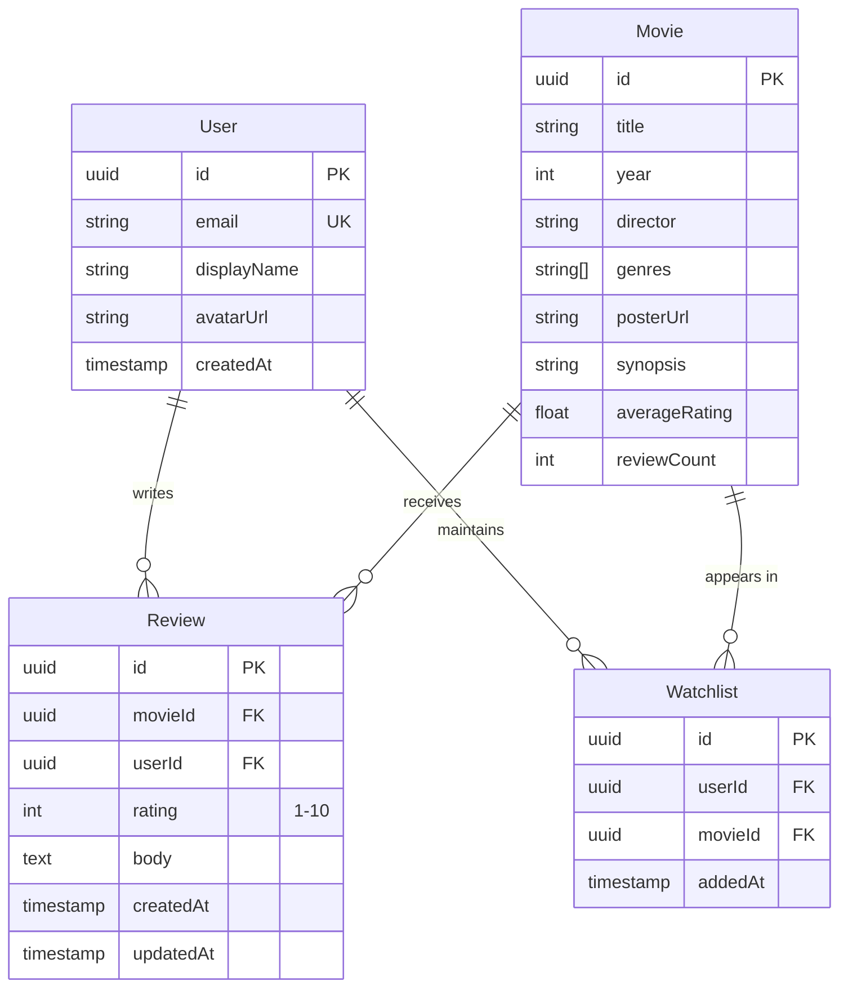
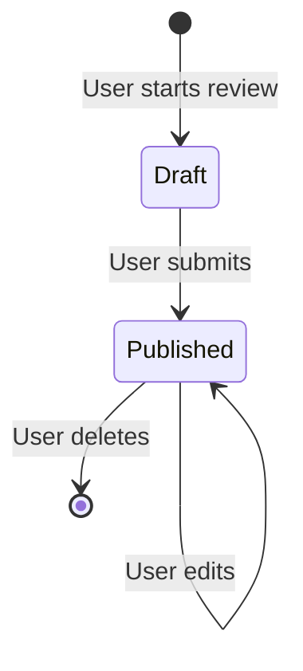

# MovieReviewApp -- Domain Guide

## Overview

A web application for browsing movies and writing reviews. Users can search for films, read and write reviews, rate movies, and maintain personal watchlists.

## Core Entities

## Business Rules

| Rule | Description |
|------|-------------|
| One review per user per movie | A user can only write one review for a given movie |
| Rating range | Ratings must be integers from 1 to 10 |
| Review requires rating | A review body is optional, but a rating is always required |
| Average recalculation | Movie's averageRating is recalculated when reviews are added/updated/deleted |
| Watchlist uniqueness | A movie can only appear once in a user's watchlist |

## Invariants

| Invariant | Enforcement |
|-----------|-------------|
| `movie.reviewCount == count(reviews for movie)` | Service layer, recalculated on review mutations |
| `movie.averageRating == avg(ratings for movie)` | Service layer, recalculated on review mutations |
| `review.rating >= 1 && review.rating <= 10` | Zod schema validation at API boundary |
| `unique(review.userId, review.movieId)` | Database unique constraint + service-level check |
| `unique(watchlist.userId, watchlist.movieId)` | Database unique constraint + service-level check |

## Domain Glossary

| Term | Definition |
|------|------------|
| Rating | Numeric score (1-10) a user assigns to a movie |
| Review | Written assessment of a movie; always includes a rating, optionally includes a text body |
| Watchlist | A user's personal list of movies they want to watch |
| Average Rating | Computed mean of all ratings for a given movie |
| Review Count | Computed count of all reviews for a given movie |

## State Machines

### Review Lifecycle

## External Integrations

| Integration | Purpose | Status |
|-------------|---------|--------|
| TMDB API | Movie catalog data (titles, posters, metadata) | Active — see ADR-006 |
