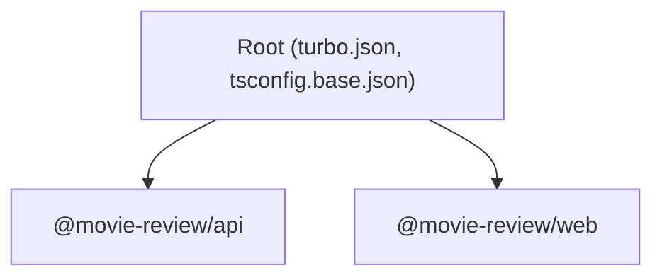

# ADR-001: Monorepo Structure with Turborepo + pnpm

**Date:** 2026-04-14
**Status:** Accepted

## Context

MovieReviewApp has two packages (API + web) that share tooling, TypeScript configuration, and will eventually share types. We need a structure that supports:

- Unified dependency management (single install)
- Parallelized builds and type-checking
- Shared base TypeScript configuration with per-package overrides
- Clear workspace boundaries for independent versioning

## Decision

Use **Turborepo** for task orchestration and **pnpm workspaces** for dependency management.

- Each app is a workspace package under `MovieReviewApp/`
- Root `package.json` delegates all tasks to Turbo (`pnpm run dev` -> `turbo run dev`)
- `turbo.json` defines task dependencies (`typecheck` depends on `^build`)
- `tsconfig.base.json` at root provides strict defaults; packages extend it
- `pnpm-workspace.yaml` declares: `MovieReviewApp/api`, `MovieReviewApp/web`, `MovieReviewApp/packages/*`

## Consequences

### Positive
- Single `pnpm install` installs everything
- Turbo caches task outputs -- subsequent builds skip unchanged packages
- Shared TypeScript base config ensures consistent strictness
- Clear package boundaries prevent accidental coupling

### Negative
- pnpm workspace hoisting can occasionally cause phantom dependency issues
- Turborepo adds a learning curve for contributors unfamiliar with monorepos
- `pnpm-lock.yaml` merge conflicts can be noisy

### Neutral
- `MovieReviewApp/packages/*` is reserved for shared packages but none exist yet

## Enforcement

- `pnpm-workspace.yaml` defines package boundaries
- `turbo.json` defines task dependency graph
- Root `package.json` pins `pnpm@9.15.0` via `packageManager` field + corepack
