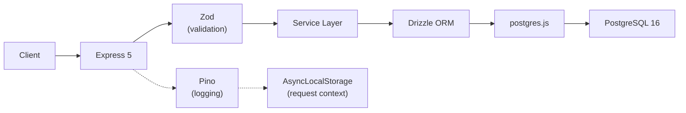

# ADR-002: Backend Stack -- Express 5 + Drizzle ORM + Zod

**Date:** 2026-04-14
**Status:** Accepted

## Context

The API needs a production-ready Node.js HTTP framework, type-safe database access, runtime validation, and structured logging. As a greenfield project, we can choose modern tools without migration concerns.

## Decision

- **Express 5** for HTTP handling
- **Drizzle ORM** with **postgres.js** driver for database access
- **Zod** for request validation and environment config
- **Pino** for structured logging with AsyncLocalStorage context propagation

### Why Express 5 over Express 4

Express 5 (stable since March 2025) adds native async error handling -- rejected promises in route handlers are automatically caught and forwarded to the error handler. This eliminates `express-async-errors` wrappers and try/catch boilerplate.

### Why Drizzle + postgres.js over Prisma + pg

- Drizzle generates zero-overhead SQL with full TypeScript inference from the schema
- postgres.js is faster than `pg`, supports pipelining, and has cleaner TypeScript types
- Schema-as-code means the Drizzle schema file IS the source of truth
- Drizzle Kit handles migration generation and studio

### Why Zod

Zod schemas serve as both validators and TypeScript type generators (`z.infer`). This eliminates the duplication of defining types separately from validation rules.

## Consequences

### Positive
- Native async error handling eliminates wrapper boilerplate
- Full type inference from database schema to API response
- Single source of truth for types (Zod schemas -> TypeScript types)
- Structured JSON logging with automatic request context

### Negative
- Express 5 ecosystem is newer -- some legacy middleware may not be compatible
- Drizzle has a smaller community than Prisma (fewer tutorials, Stack Overflow answers)
- postgres.js is less commonly used than `pg` -- some tools expect `pg` interfaces

### Neutral
- `tsx` is used for development (fast TypeScript execution without compilation step)
- `tsc` is used for production builds

## Enforcement

- Code review checks for Repository-Service pattern (ADR-005)
- TypeScript strict mode catches type mismatches at compile time
- `docs/MovieReviewApp/GOTCHAS.md` documents Express 5 and postgres.js-specific pitfalls
