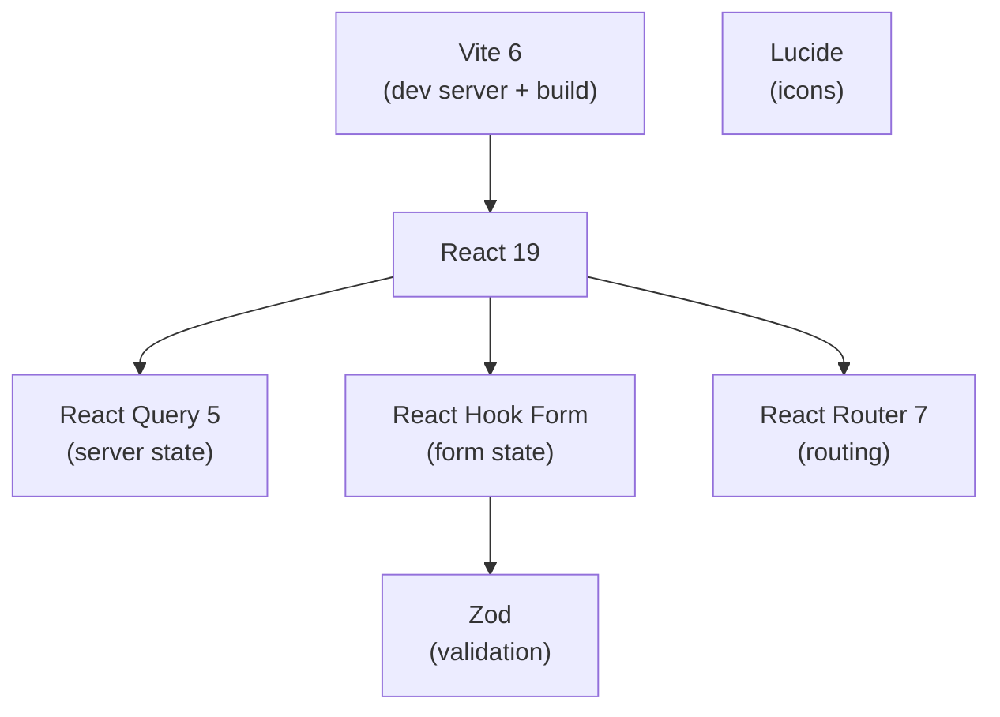

# ADR-003: Frontend Stack -- React 19 + Vite + React Query

**Date:** 2026-04-14
**Status:** Accepted

## Context

The frontend needs a modern, performant UI framework with excellent developer experience, type safety, and a clear strategy for server-state management and form handling.

## Decision

- **React 19** for UI rendering
- **Vite 6** for dev server and production builds
- **TanStack React Query 5** for server-state management
- **React Hook Form 7** with **Zod** resolver for form handling
- **React Router 7** for client-side routing
- **Lucide** for icons

### Why React Query over useState + useEffect

React Query provides declarative cache management, background refetching, stale-while-revalidate semantics, and error/loading states out of the box. The `useState + useEffect` pattern for data fetching creates race conditions, lacks caching, and produces duplicate boilerplate.

### Why Vite over Next.js/Remix

This is a client-side SPA with a separate API. Vite provides near-instant HMR, optimized production builds, and minimal configuration without the complexity of a full-stack framework. The API is a standalone Express server.

### Why React Router 7

React Router v7 provides type-safe routing, nested layouts, and data loaders. It evolved from Remix and is the most mature routing solution for React SPAs.

## Consequences

### Positive
- Vite provides near-instant dev server startup and HMR
- React Query eliminates data-fetching boilerplate and race conditions
- React Hook Form with Zod gives type-safe form validation with minimal re-renders
- Dev proxy (`/api` -> `:3001`) eliminates CORS issues during development

### Negative
- React 19 is relatively new -- some community libraries may lag behind
- No CSS framework chosen yet (deferred to feature implementation)
- No SSR -- pure SPA means slower initial load vs server-rendered alternatives

### Neutral
- `staleTime: 60_000` is the default query stale time -- tunable per query
- Testing Library + jsdom for component tests (not a real browser)

## Enforcement

- Code review enforces React Query for all API calls (no raw `fetch` in components)
- `docs/best_practices/react.md` documents component patterns
- `docs/design/` documents UI patterns and component anatomy
