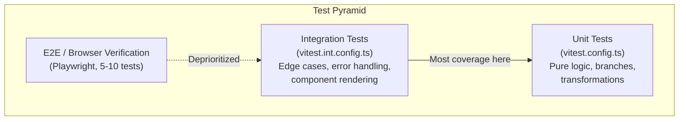

# ADR-004: Testing Strategy -- Vitest + Testing Library + Playwright

**Date:** 2026-04-14
**Status:** Accepted

## Context

The testing philosophy (`docs/TESTING_PHILOSOPHY.md`) mandates behavior-focused tests with BDD-style organization, Outside-In TDD, and a test pyramid that deprioritizes E2E in favor of integration tests. We need tooling that supports fast TDD loops and realistic component testing.

## Decision

- **Vitest** for all unit and integration tests (API + web)
- **Testing Library** for React component tests
- **Playwright** for interactive browser verification (not persisted E2E suites)
- **Separate vitest configs** per test type: `vitest.config.ts` (unit) and `vitest.int.config.ts` (integration)

### File naming convention

| Type | Pattern | Config |
|------|---------|--------|
| Unit | `*.unit.test.ts` / `*.unit.test.tsx` | `vitest.config.ts` |
| Integration | `*.int.test.ts` / `*.int.test.tsx` | `vitest.int.config.ts` |

### Why separate configs

Unit tests run with no external dependencies and sub-second feedback for TDD. Integration tests need longer timeouts (15s), may require a running database, and are slower. Separate configs allow `npm run test:unit` to be instant while `npm run test:int` runs the heavier suite.

### Why Vitest over Jest

Vitest is Vite-native, supports ESM natively, runs TypeScript without transformation, and uses the same config format as Vite. Jest requires additional configuration for ESM and TypeScript.

### Why Playwright for browser verification only

Per `docs/TESTING_PHILOSOPHY.md`, E2E tests are limited to 5-10 stable happy-path scenarios. Most browser verification is interactive (via `/browser-test` skill) and not persisted as permanent test files. This avoids the maintenance burden of brittle E2E suites.

## Consequences

### Positive
- `test:unit` runs in <1s for TDD feedback loops
- Integration tests use real database (no mocking repositories)
- Testing Library encourages testing user behavior, not implementation details
- `passWithNoTests: true` prevents CI failures when a package has no tests yet

### Negative
- Two vitest config files per package (4 total)
- Developers must remember the naming convention (`.unit.test.ts` vs `.int.test.ts`)
- Playwright setup requires additional configuration when E2E tests are added

### Neutral
- `jsdom` environment for web component tests (not a real browser, but fast)
- `@testing-library/jest-dom` matchers loaded globally via setup file

## Enforcement

- `docs/TESTING_PHILOSOPHY.md` defines test structure and naming rules
- Feature file parity: every `.feature` scenario must have a corresponding test
- BDD describe blocks: `describe("given X")` / `describe("when Y")` pattern
- Test names: present tense, no "should"
