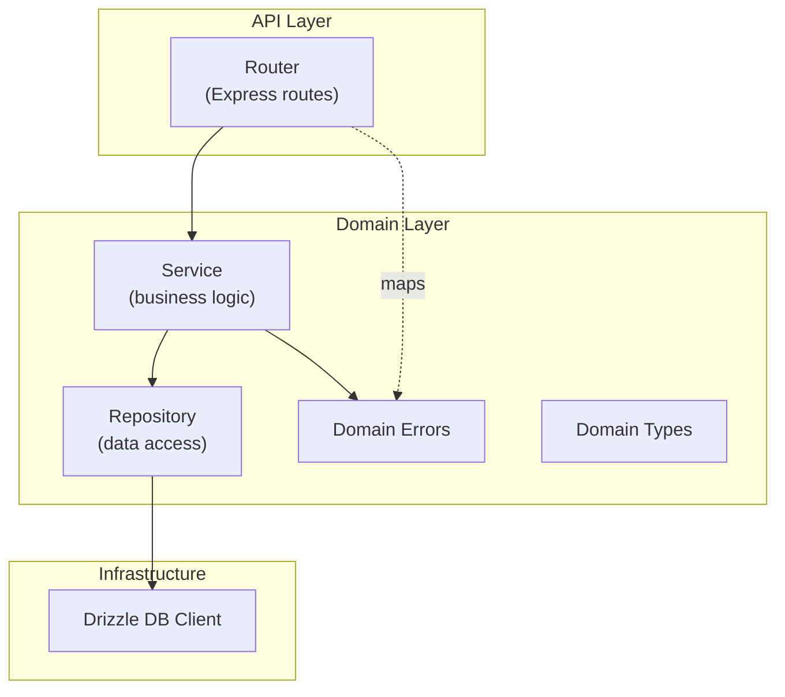

# ADR-005: Repository-Service Architecture Pattern

**Date:** 2026-04-14
**Status:** Accepted

## Context

We need a clear separation between HTTP handling, business logic, and data access that is testable, maintainable, and follows domain-driven design principles. The architecture should support the Repository-Service pattern described in `docs/best_practices/repository-service.md`.

## Decision

Three-layer architecture with strict dependency direction:



### Layer responsibilities

| Layer | Responsibility | Depends on |
|-------|---------------|------------|
| **Router** | HTTP request/response, Zod validation, auth, error mapping | Service, Domain Errors |
| **Service** | Business logic, orchestration, invariant enforcement | Repository, Domain Types |
| **Repository** | Pure data access (CRUD via Drizzle) | Drizzle DB client |

### Conventions

- **Repositories** accept `DrizzleDb` in constructor. Methods are pure CRUD -- no business logic.
- **Services** use `static create(db: DrizzleDb)` factory methods. They instantiate their own repositories.
- **Domain errors** are framework-agnostic (not HTTP). Routers map them to status codes.
- **File structure** per feature:

```
src/domains/<feature>/
  <feature>.router.ts
  <feature>.service.ts
  <feature>.repository.ts
  <feature>.table.ts        # Drizzle table definition
  types.ts                   # Domain types (Zod schemas + inferred types)
  errors.ts                  # Domain-specific errors
```

### Dependency rule

Dependencies flow inward: Router -> Service -> Repository. The domain layer (Service, Repository) never imports from the API layer (Router) or UI layer.

## Consequences

### Positive
- Clear boundaries make each layer independently testable
- Repositories are thin and reusable across services
- Services are the natural place for business rules and invariants
- Domain errors decouple business logic from HTTP status codes
- Integration tests can test Services directly without HTTP overhead

### Negative
- More files per feature (router + service + repository + table + types + errors)
- May feel like over-engineering for simple CRUD features
- Factory pattern adds a level of indirection

### Neutral
- Domain types (Zod schemas) live in the domain layer, not the API layer
- Table definitions are colocated with their feature, re-exported through `db/schema.ts`

## Enforcement

- Code review (reviewer agent checks for SOLID/CUPID compliance)
- `docs/best_practices/repository-service.md` provides reference implementation
- Feature scaffolding follows the file structure convention
