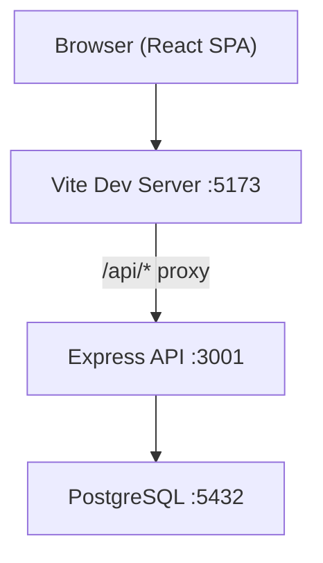
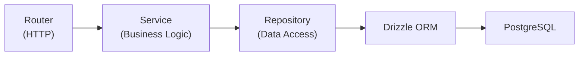

# MovieReviewApp -- Application Specification

**Last updated:** 2026-04-14

## Overview

A web application for browsing movies, writing reviews, and maintaining watchlists.

## Tech Stack

### Backend

| Technology | Version | Purpose |
|-----------|---------|---------|
| Node.js | 22.x | Runtime |
| Express | 5.x | HTTP framework |
| TypeScript | 5.7+ | Type safety |
| Drizzle ORM | 0.40.x | Database queries + migrations |
| postgres.js | 3.4.x | PostgreSQL driver |
| Zod | 3.24.x | Runtime validation |
| Pino | 9.x | Structured logging |
| Vitest | 3.x | Testing |

### Frontend

| Technology | Version | Purpose |
|-----------|---------|---------|
| React | 19.x | UI framework |
| Vite | 6.x | Build tool + dev server |
| TanStack React Query | 5.x | Server-state management |
| React Hook Form | 7.x | Form state management |
| React Router | 7.x | Client-side routing |
| Tailwind CSS | 4.x | Utility-first CSS framework |
| shadcn/ui patterns | — | Component patterns (cn(), CVA, design tokens) |
| Zod | 3.24.x | Form validation |
| Lucide | 0.475.x | Icons |
| Vitest | 3.x | Testing |
| Testing Library | 16.x | Component test utilities |

### Infrastructure

| Technology | Purpose |
|-----------|---------|
| PostgreSQL 16 | Primary database |
| Docker Compose | Local database provisioning |
| pnpm 9 | Package manager |
| Turborepo | Monorepo task orchestration |

## Architecture

### System Overview



### Backend Pattern: Repository-Service



- **Router:** HTTP request/response handling, Zod validation, auth
- **Service:** Business logic, orchestration, domain error throwing
- **Repository:** Pure data access via Drizzle queries
- See: `docs/best_practices/repository-service.md`

### Frontend Pattern

- Domain-driven folder structure under `src/domains/`
- React Query for all server state (no `useState + useEffect` for API data)
- React Hook Form + Zod for all forms
- See: `docs/best_practices/react.md`

## File Structure

```
MovieReviewApp/
  docker-compose.yml
  api/
    package.json
    tsconfig.json
    drizzle.config.ts
    vitest.config.ts           # *.unit.test.ts
    vitest.int.config.ts       # *.int.test.ts
    .env.example
    src/
      index.ts                 # Server entry point
      app.ts                   # Express app factory
      config.ts                # Zod-validated env config
      db/
        index.ts               # Drizzle client
        schema.ts              # Schema barrel file
      middleware/
        request-context.ts     # AsyncLocalStorage context
        error-handler.ts       # Global error handler
      utils/
        logger.ts              # Pino logger factory
      domains/                 # Feature modules (TBD)
        <feature>/
          <feature>.router.ts
          <feature>.service.ts
          <feature>.repository.ts
          <feature>.table.ts
          types.ts
          errors.ts
  web/
    package.json
    tsconfig.json
    vite.config.ts
    vitest.config.ts           # *.unit.test.{ts,tsx}
    vitest.int.config.ts       # *.int.test.{ts,tsx}
    .env.example
    index.html
    src/
      main.tsx                 # React entry
      App.tsx                  # Root with QueryClientProvider
      vite-env.d.ts
      test/
        setup.ts               # jest-dom matchers
      domains/                 # Feature modules (TBD)
        <feature>/
          components/
          hooks/
          types.ts
```

## ADRs

| # | Decision | Status |
|---|----------|--------|
| 001 | [Monorepo with Turborepo + pnpm](../../docs/MovieReviewApp/adr/001-monorepo-structure.md) | Accepted |
| 002 | [Backend: Express 5 + Drizzle + Zod](../../docs/MovieReviewApp/adr/002-backend-stack.md) | Accepted |
| 003 | [Frontend: React 19 + Vite + React Query](../../docs/MovieReviewApp/adr/003-frontend-stack.md) | Accepted |
| 004 | [Testing: Vitest + Testing Library + Playwright](../../docs/MovieReviewApp/adr/004-testing-strategy.md) | Accepted |
| 005 | [Repository-Service pattern](../../docs/MovieReviewApp/adr/005-repository-service-pattern.md) | Accepted |
| 006 | [External API Gateway pattern](../../docs/MovieReviewApp/adr/006-external-api-gateway-pattern.md) | Accepted |
| 007 | [CSS framework: Tailwind CSS + shadcn/ui](../../docs/MovieReviewApp/adr/007-css-framework.md) | Accepted |

## Phased Delivery

### Phase 1: Foundation (Complete)

- Runnable Express API with health endpoint + TMDB integration (10 endpoints)
- React app with Tailwind CSS, global layout, 6 base components, 7 routes
- PostgreSQL via Docker Compose
- Structured logging with Pino
- 95+ tests (unit + integration), CI-ready
- 7 ADRs documenting all architectural decisions

### Phase 2: Core Features (Next)

- Home page wired to TMDB API (now playing, popular, coming soon, top rated)
- Movie detail page with full info, cast, trailers
- Movie search with filters
- Genre browsing
- User authentication (Google + Facebook OAuth)

### Phase 3: Social Features (Future)

- Write and display reviews with star ratings
- Comments on reviews
- Review likes / helpful votes
- Watchlist management
- Release date reminders
- User profiles and dashboard
- Notification system
